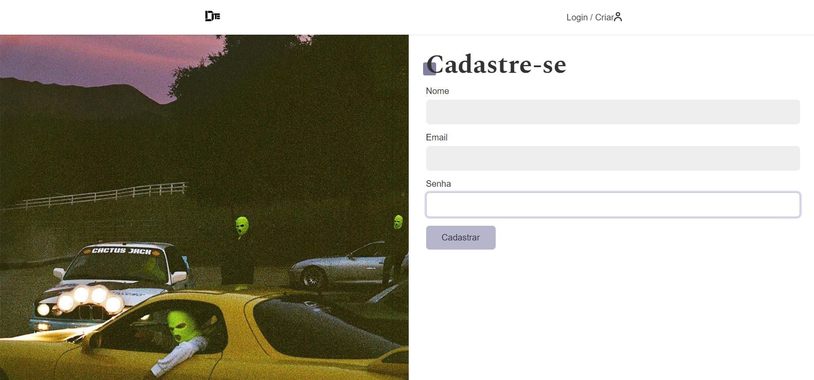

# **CSI606-2023-02 - Remoto - Proposta de Trabalho Final**

## *Aluna(o): Vitor Marques dos Santos*

--------------
<!-- Descrever um resumo sobre o trabalho. -->

### Resumo

  A atividade de projeto prático consiste no desenvolvimento de uma API utilizando Node.js no backend e sendo consumida por React no frontend. O nome do projeto é Drifters, um sistema web onde será exibido um feed de fotos de carros preparados para drift, postadas pelos usuários. As principais funcionalidades do sistema incluem a criação de usuário, realização de login, visualização do feed de fotos, comentário em fotos de outros usuários e postagem de fotos. O banco de dados utilizado é o SQLite, contendo três tabelas referentes a usuário, fotos e comentários. Possuido as seguintes operações para cada entidade:
  
  - Inserir - Create
  - Atualizar - Update
  - Excluir - Delete
  - Recuperar - Read - todos os itens.

<!-- Apresentar o tema. -->
### 1. Tema

  O trabalho final tem como tema o desenvolvimento de uma aplicação para visualização de um feed de fotos e interação através de comentários. O projeto possui o nome de Drifters.

<!-- Descrever e limitar o escopo da aplicação. -->
### 2. Escopo

  Este projeto terá as seguintes funcionalidades: cadastrar usuário, realizar login, postar fotos, comentar fotos e realizar alterações sobre as postagens feitas. 

<!-- Apresentar restrições de funcionalidades e de escopo. -->
### 3. Restrições

  Neste trabalho, não será considerada a utilização de token de autenticação para o acesso às funcionalidades da API (criado apenas para testes e estudo). A única interação entre o usuário e as postagens serão os comentários, não está no escopo do trabalho a contabilização de likes.

<!-- Construir alguns protótipos para a aplicação, disponibilizá-los no Github e descrever o que foi considerado. //-->
### 4. Protótipo

  Não foram criados protótipos para todas as páginas do projeto, possuindo até o momento a logo do projeto, para a qual foi utilizado o Figma na criação, e uma imagem de como será a tela para cadastro de usuários.

  
  

### 5. Referências

  Referências podem ser incluídas, caso necessário. Utilize o padrão ABNT.
