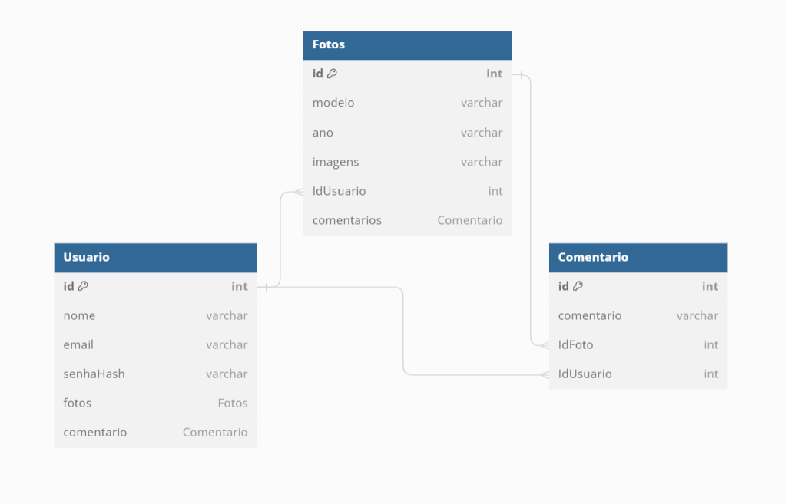

# **CSI606-2023-02 - Presencial - Trabalho Final - Resultados**

## *Aluna(o): Vitor Marques dos Santos*

--------------

<!-- Este documento tem como objetivo apresentar o projeto desenvolvido, considerando o que foi definido na proposta e o produto final. -->

### Resumo

  A atividade de projeto prático consiste no desenvolvimento de uma API utilizando Node.js no backend e sendo consumida por React no frontend. O nome do projeto é Drifters, um sistema web onde será exibido um feed de fotos de carros preparados para drift, postadas pelos usuários. As principais funcionalidades do sistema incluem a criação de usuário, realização de login, visualização do feed de fotos, comentário em fotos de outros usuários e postagem de fotos.

#### Modelo utilizado

### 1. Funcionalidades implementadas
<!-- Descrever as funcionalidades que eram previstas e foram implementas. -->

 - CRUD do usuário.
 - CRUD do das fotos.
 - CRUD dos comentários.
 - Página de login.
 - Visualização do feed de fotos.
 - Comentários em fotos.
  
### 2. Funcionalidades previstas e não implementadas
<!-- Descrever as funcionalidades que eram previstas e não foram implementas, apresentando uma breve justificativa do porquê elas não foram incluídas -->

 - Scroll infinito do feed de fotos.
 - Utilização de token para autentiação e persistência do login.
 - Contabilização de likes (Não era parte do escopo, mas eu gostaria de ter colocado na aplicação).

### 3. Outras funcionalidades implementadas
<!-- Descrever as funcionalidades implementas além daquelas que foram previstas, caso se aplique.  -->

 Não se aplica. 

### 4. Principais desafios e dificuldades
<!-- Descrever os principais desafios encontrados no desenvolvimento do trabalho, quais foram as dificuldades e como elas foram superadas e resolvidas. -->

 As principais dificuldades encontradas foram a tentativa de uso do token de autenticação e a utilização do React. O token foi utilizado somente para estudo e para implementação em futuros trabalhos. Já o React foi utilizado em sala de aula, como foi o primeiro contato para realização do trabalho, se tornou uma oportunidade de aprender e se interessar por novas tecnologias. 

### 5. Instruções para instalação e execução
<!-- Descrever o que deve ser feito para instalar (ou baixar) a aplicação, o que precisa ser configurando (parâmetros, banco de dados e afins) e como executá-la. -->

### 6. Referências
<!-- Referências podem ser incluídas, caso necessário. Utilize o padrão ABNT. -->

 Não se aplica. 